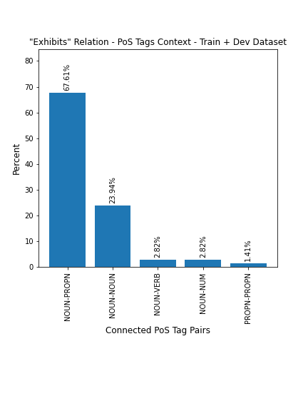

# Shortest Dependency Paths (SDP) with 'dep' tags
This archive includes the SDPs from the BB-Rel 2019 train and dev datasets where a `dep` tag can be found.

## Files organization
The files are organized following the structure:

*   The train or dev dataset;
*   The [(Universal Dependencies) Part-of-Speech (UPoS) tags][upos-dep-tags] of the two tokens connected by the 'dep' relation tag (either direction);
*   The document filename containing the SDP;
*   Images with SDP's and Relations;

For example, all SDPs from the training dataset including a 'dep' connection between a *noun* and a *verb* -- either `noun<---verb` or `noun--->verb` -- can be found on

```
broken-deps/train/noun-verb/*/deps*.png
```

obs.:  the "*" here is a [shell wildcard][sh-glob]

## The image files
At the bottom of the archive structure you'll find images for

*   Shortest Depencency Paths (with 'dep' tags);
*   BRAT relation annotations highlighting the relations with 'dep' tags inside their SDPs.

The images following the format `deps*.png` are the sentences with the SDPs. The other files indicate the relations where the entities SDPs include the 'dep' tags. Note that for the entities with multiple tokens, the rightmost ones were used as the SDP endpoints.

### An example of visualization
A `noun-propn` connection through a `dep` tag on the Dev dataset can be seen on the file

```
broken-deps/dev/noun-propn/BB-rel-19004249/deps.png
```

in the `R1` relation connecting `Staphylococcus aureus` to `human` from the text span

```
two human pathogens: Staphylococcus aureus and Escherichia coli.
```

located on the file `broken-deps/dev/noun-propn/BB-rel-19004249/screenshot_2020-09-29_11-21-15.png`. Using the *righmost token* strategy, the path between `Staphylococcus aureus` and `human` entities will be:

```
human <--amod--- pathogens ---dep--> aureus
 ADJ <---amod------ NOUN -----dep---> PROPN
                    ^^^^^^^^^^^^^^^^^^^^^^^
```

## The PoS tags
We used the [Universal Dependencies PoS tags][upos-dep-tags]. The following tags were identified as `dep` endpoints:

* [ADJ][upos-adj]: Adjectives
* [NOUN][upos-noun]: Common nouns
* [NUM][upos-num]: Numerals
* [PROPN][upos-propn]: Proper nouns
* [SYM][upos-sym]: Symbols -- things that aren't words (and not punctuation symbols)
* [VERB][upos-verb]: Verbs -- main verbs, not auxiliary
* [X][upos-x]: Other -- words that cannot be assigned to any category

A list of all UPoS tags can be found on [https://universaldependencies.org/docs/u/pos/][upos-dep-tags]. Note that the links for the individual tags on the page seems to be broken but they can be accessed by inserting the PoS tag on the url:

```
https://universaldependencies.org/u/pos/<TAG>.html
```

for example, the **SYM** tag page can be visualized with: [https://universaldependencies.org/u/pos/SYM.html][upos-sym]

# Distribution of PoS tags connections
Below are the frequencies of UPoS tags connected by 'dep' tags per dataset and relations.





[sh-glob]: https://tldp.org/LDP/GNU-Linux-Tools-Summary/html/x11655.htm
[upos-dep-tags]: https://universaldependencies.org/docs/u/pos/
[upos-adj]: https://universaldependencies.org/u/pos/ADJ.html
[upos-noun]: https://universaldependencies.org/u/pos/NOUN.html
[upos-num]: https://universaldependencies.org/u/pos/NUM.html
[upos-propn]: https://universaldependencies.org/u/pos/PROPN.html
[upos-sym]: https://universaldependencies.org/u/pos/SYM.html
[upos-verb]: https://universaldependencies.org/u/pos/VERB.html
[upos-x]: https://universaldependencies.org/u/pos/X.html
